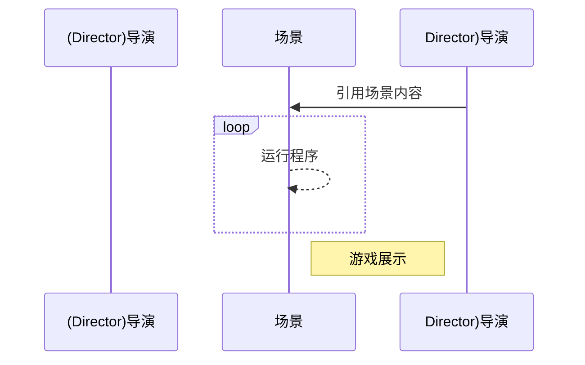

# 引擎基础

+ 游戏的原理和机制
+ 游戏开发技术
+ 认识cocos2d-x引擎
+ cocos2d-x跨平台开发环境搭建

## 学习目标

- 了解游戏生命周期

- 了解程序开发,编译,运行,调试

+ cocos2d-x引擎框架
+ cocos2d-x坐标系统
+ cocos2d-x内存管理
+ UI系统
+ 事件处理

## 设计思想

本节课教大家知道如何操作和了解cocos2d-x的常用控件

主要介绍内容

- 导演(director)
- 场景(scene)
- 图层(layer)
- 精灵(sprite)
- 动作(action)
- 节点(node)

导演->场景->层级->精灵



## 场景

 **场景(Scene)** 是一个容器，容纳游戏中的各个元素，如精灵，标签，节点对象。它负责着游戏的运行逻辑，以帧为单位渲染内容。在使用 Cocos2d-x 进行游戏的开发中，你可以制作任意数量的场景，并在不同场景间轻松切换。

### 创建场景

1. 创建一个类
2. 类继承节点进行重写

创建自定义的类,类名放入项目文件中的`Class`里,

新建一个头文件`xxx.h`

```cpp
#pragma once 			//预处理,让头文件不会被重复包含
#ifndef EXAMPLE_H		
#define EXAMPLE_H

#include "cocos2d.h"	//cocos2d的头文件,里面包含了多个cocos2d所需要的头文件

//创建一个自定义场景,并继承一个图层类
class Example : public cocos2d:layer{
public:
    //创建场景函数
    static cocos2d::createScene();
    //初始化
    virtual bool init() override;
     //调用宏
    CREATE_FUNC(Example);
};

#endif //EXAMPLE_H
```

### 场景的生命周期

```cpp
//初始话时调用
bool init();

//进入层调用
void onEnter();

//进入层且过渡动画结束时调用
void EnterTransitionDidFinish();

//退出层时调用
void onExit();

//退出层开始过渡动画时调用
void onExitTransitionDidStart();

//被清理时调用
void cleanup();
```

**如果进行多个场景进行切换? 使用`Director`导演类进行场景管理**

## 导演类

导演类顾名思义,就是整个游戏中的导演,游戏的运行机制都是由导演类负责,导演类里面提供了很多的的场景操作函数,已经游戏程序的生命周期,`Director`类能做的操作

```cpp
class Director{
    //通过单例模式对象来获取的
    static Director* getInstance();

    //暂停游戏
    void pause();
    //从暂停中恢复游戏	
    void resume();

    //第一个场景启动调用该函数
    void runWithScene(Scene *scene);

    //切换到下一场景,并将当前场景挂载在栈中
    void pushScene(Scene *scene);

    //返回到上一次场景
    void popScene(Scene *scene);

    //回到根场景,也就是最开始的场景
    void popToRootScene();

    //切换场景,原来的会被释放掉
    void replace(Scene *scene);
};

```

### 使用导演类进行全局设置

获取一个导演类对象,导演类是一个单例模式对象,所以是通过单例模式`getInstance` 来获取

```cpp
auto direct=Director::getInstance();
direct->runWithScene();	//创建一个场景
```

导演对象在启动时需要调用到的一些函数

```cpp
//获取实例对象
auto director = Director::getInstance();
//设置glview
director->setOpenGLView(glview);
// 显示 FPS
director->setDisplayStats(true);
// 设置帧率
director->setAnimationInterval(1.0 / 60);
//设置屏幕拉升大小
director->setContentScaleFactor();
```


第一次运行,程序用`runWithScene`启动

```cpp
auto scene = Scene::create();		//创建一个场景
director->runWithScene(scene);
```

### Scene 场景类

```cpp
Scene scene=Scene::create();	//场景的创建
auto layer = Layer::create();	//场景图层
scene->addChild(layer);			//场景添加图层
```


## 游戏主程序

程序中的main函数首先开始调用的就是`AppDelegate`委托类继承自`Application`是cocos2d的入口文件,也是自定义的一个类,里面有程序调用的生命周期,控制游戏中的一些全局对象

```cpp
class AppDelegate{
    void initContextAttrs();
    //启动完成后调用的函数
    bool applicationDidFinishLaunching();
    //进入后台时候调用的函数
    void applicationDidEnterBackground();
    //进入前台时候调用的函数
    void applicationWillEnterForeground();
};
```

## 图层(layer)

颜色图层

```cpp
//颜色层
class LayerColor{
	//设置填充颜色
	static LayerColor* layerWithColor(color3B& color);
};

//渐变色图层
class LayerGradient{
    static LayerGradient* layerWithColor(color3B& color);
};
```

### 节点(Node)

每个cocos2d对象都继承了节点类,节点类有下列方法

场景，节点，节点文件的区别

- 场景文件不能改变大小
- 图层文件可以改变大小
- 节点文件没有大小


- 场景文件不能与场景文件嵌套
- 图层可以和节点嵌套

### 场景坐标


### 引用计数


## 计时器

每个游戏都应该是循环的在不断运行的,而在执行的过程中要定时执行某个任务,就需要计时器来对精灵对象操作

schedule函数调用每个调度对象,而每个对象都继承自Node类

```cpp
//普通计时器,计时时间
void schedule(SEL_SCHEDULE selector,int interval);

//每帧自动调用一次update函数
void scheduleUpdate(SEL_SCHEDULE selector);
```

使用示例

```cpp
//创建一个update函数
void update(float dt);

//让程序自动调用update
```


## 总结

