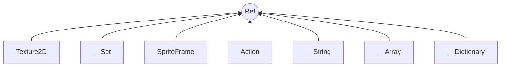

# 常用数据结构

## Ref 

Ref类,cocos2d-x几乎所有的类都派生于它们

`Ref `在cocos2d-x 2.x 的版本叫`CCObject`类,3.x版本改名叫`Ref`,Ref是cocos2d节点类的重要接口,内部提供了自动内存申请自动释放的接口,所有继承Ref的节点都实行引用计数,节点引用数为0,就会自动释放内存



# 数据类

Cocos2d-x 是一个游戏引擎,内部封装了游戏的常用引擎接口,代码风格充分的利用了面向对象编程的特性,使用户在使用的过程非常方便和轻松

## 常用容器使用

+ Vector类
+ Map类

#### __Array 类

```cpp
class __Array{
	static __Array* create();
    static __Array* createWithObject(Ref *obj,...);
    
    //添加元素
    void addObject(Ref *object);
    
};
```

#### Vector 容器

`___Array` 类的替代品,用法和std::vector 基本类似,`vector`会,

```cpp
//添加元素
void pushBack(T &&val);

//从尾部删除元素
void popBack();

//
```

#### Map容器

`Map`

## 数据类

+ Value
+ Vec2
+ Rect
+ Size


### 包装类`Value`

Value,将常用数据类型进行包装成类来使用,除了  `int` `char` `float` ,还包括了`c++`标准类

+ `std::string`
+ `std::vector<Value>`
+ `std::unordered_map<string,Value>`
+ `std::map<string,Value>`

```cpp
class Value{
    Value();						//参数,包装对象
    Value asValue();				//获取对应类型数据
    bool isNull();					//判断是否为空
    string getDescription(); 		//获取对象信息
};
```


1. `Vec2` 坐标
2. `rect`矩形
3. `size`大小

### 坐标系统

cocos2d中-x的屏幕坐标系,X轴是从左向右的,Y轴从下往上的,和一般的数学中的数据Y一致

### 二维向量

二维向量是游戏开发中常见的

类名:`Vec2`

里面实现了二维坐标系常用函数,使得使用起来非常轻松

```cpp
//坐标
class Vec2{
    float x;
    float y;
    Vec2();
    Vec2(float x,float y);   

    //获取坐标锚点  默认是0.5
    Vec2 getAnchorPoint();

    //获取坐标位置,默认0,0;
    Vec2 getPosition();
}
```

### 矩形

类名:Rect

```cpp
//矩形
class Rect{
    float x;
    float y;
    float wid;
    float hei;

    Rect(float x,float y,float wid,float hei);
};
```

### 大小

类型:Size

```cpp
//大小
class Size{
    float height;
    float width;
    Size(float wid,float hei );
};
```


## 总结

1. Vector容器
2. Map容器
3. 数据包装类