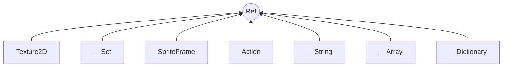

# 常用数据结构

## 两大类

cocos2d-x几乎所有的类都派生于它们

+ Ref
+ Value

## Ref 

`Ref `在cocos2d-x 2.x 的版本叫`CCObject`类,3.x版本改名叫`Ref`



### 常用容器使用

#### __Array 类

```cpp
class __Array{
	static __Array* create();
    static __Array* createWithObject(Ref *obj,...);
    
    //添加元素
    void addObject(Ref *object);
    
};
```

#### Vector 容器

___Array 类的替代品

```cpp

```


## 包装类

Value,将常用数据类型进行包装成类来使用,除了  `int` `char` `float` ,还包括了c++标准类

+ `std::string`
+ `std::vector<Value>`
+ `std::unordered_map<string,Value>`
+ `std::map<string,Value>`

```cpp
class Value{
	Value();						//参数,包装对象
    Value asValue();				//获取对应类型数据
  	bool isNull();					//判断是否为空
    string getDescription(); 		//获取对象信息
};
```

